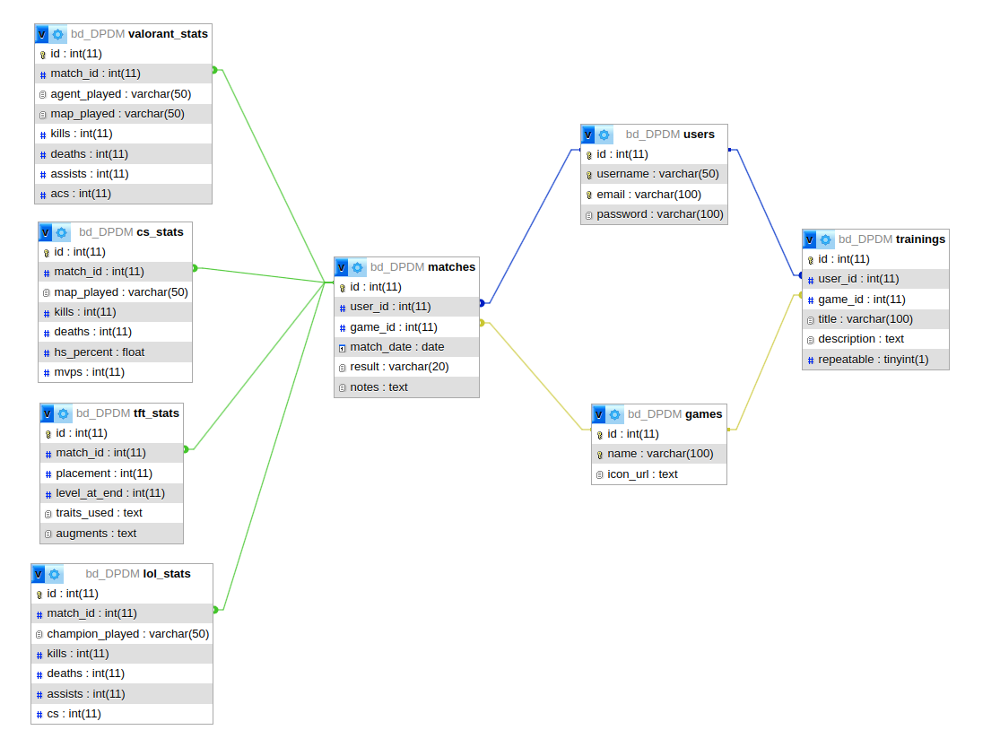

# Grind Master

## Sobre o app

**Grind Master** é um aplicativo desenvolvido para jogadores competitivos que desejam acompanhar sua evolução em jogos como **League of Legends**, **Valorant**, **CS2**, **Mortal Kombat** e **Teamfight Tactics**.

A proposta é permitir que os usuários registrem suas partidas, avaliem seu desempenho, acompanhem sua progressão em rankings e visualizem gráficos com base em seus resultados ao longo do tempo. É a ferramenta ideal para quem leva os jogos a sério e quer monitorar sua jornada rumo ao topo!

### Funcionalidades básicas (prioritárias):

- [ ] Cadastro e login de usuário
- [ ] Cadastro de jogos utilizados pelo usuário
- [ ] Registro de partidas com os seguintes dados:
  - [ ] Jogo
  - [ ] Data
  - [ ] Resultado (Vitória / Derrota)
  - [ ] Elo ou ranking
  - [ ] Função / Personagem jogado
  - [ ] Nota de desempenho (de 1 a 10)
  - [ ] K/D (Abates/Mortes) **Em jogos que se apliquem**
- [ ] Listagem de partidas por jogo
- [ ] Gráficos de evolução do jogador
- [ ] Cadastro de treinos
- [ ] Controle de treinos feitos

### Funcionalidades adicionais (ou futuras):

- [ ] Estatísticas comparativas entre jogos
- [ ] Análise de desempenho por função/personagem
- [ ] Metas semanais de performance
- [ ] Importação automática de dados por APIs públicas (ex: Riot API)
- [ ] Compartilhamento de perfil com amigos
- [ ] Notificações de metas ou lembretes de treino
- [ ] Modo escuro

---

## Protótipos de tela

[Clique aqui para visualizar os protótipos no Figma](https://www.figma.com/design/enk7KwUe8GphBma7DAzwER/GrindMaster?node-id=0-1&t=ZUzehcYBupAMxRVu-1)

---

## Modelagem do banco

A modelagem a seguir foi pensada com foco em persistência local usando banco de dados relacional SQLite.

## Planejamento de sprints

| Sprint      | Período    | Tarefas principais                                                                 | Status      |
|-------------|------------|-------------------------------------------------------------------------------------|-------------|
| Sprint 1    | Semana 1 | Definir funcionalidades, criar repositório, elaborar protótipos e modelagem do DB     | [X] Concluído |
| Sprint 2    | Semana 2-3 | Navegação inicial                                                                   | [X] Concluído |
| Sprint 3    | Semana 4-5 | Exibição de partidas                                                                | [X] Concluído |
| Sprint 4    | Semana 6-7 | Registro de partidas, implementação de cadastro e login funcional                   | [ ] A fazer   |
| Sprint 5    | Semana 8-9| Implementação dos gráficos de desempenho                                             | [ ] A fazer   |
| Sprint 6    | Semana 10-11 | Refino visual, testes, funcionalidades adicionais e entrega final                 | [ ] A fazer   |

---

## Atualizações desde o último checkpoint

[Vídeo de apresentação do CheckPoint 2](https://youtu.be/c2_dMnnfaTs)

Utilizei o NativeWind para estilização de todas as telas e componentes da aplicação.
Utilizei o Zustand para criar um hook chamado useGame, que gerencia qual jogo o usuário está interagindo na aplixação, mudando os Cards das telas principais e formulários das modais com base no jogo atual. 
Utilizei o aninhamento de layouts para ter um Stack na telas não autenticadas e um Tabs nas telas autenticadas.
Criei componentes Cards reutilizáveis, para contextos diferentes.
Utilizei dados mocks para testar o funcionamento da aplicação.

---

> **Repositório GitHub:** [github.com/yuutokolanz/grind-master](https://github.com/yuutokolanz/Grind-Master)

---

